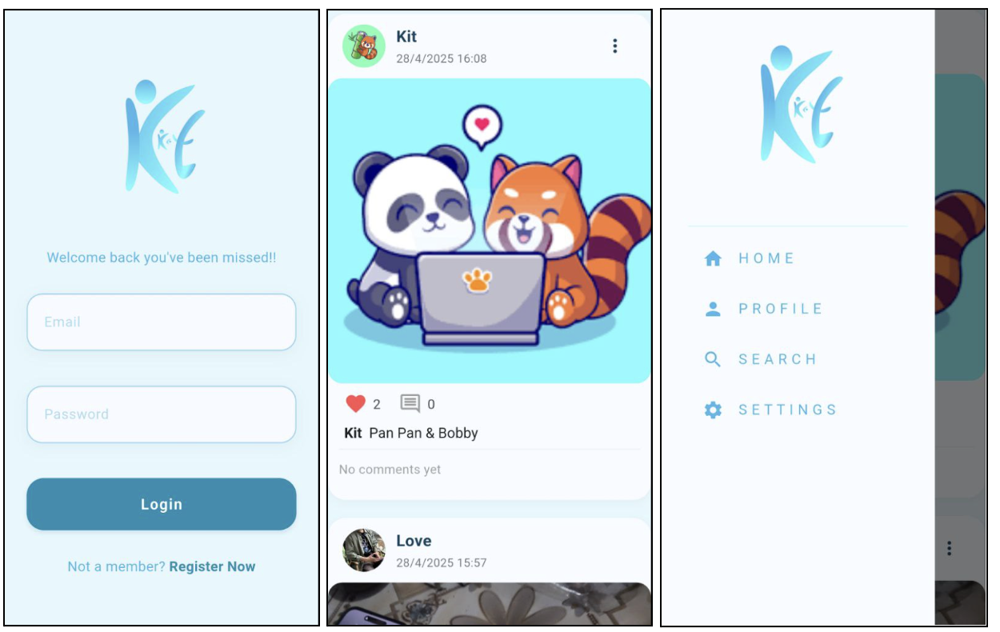
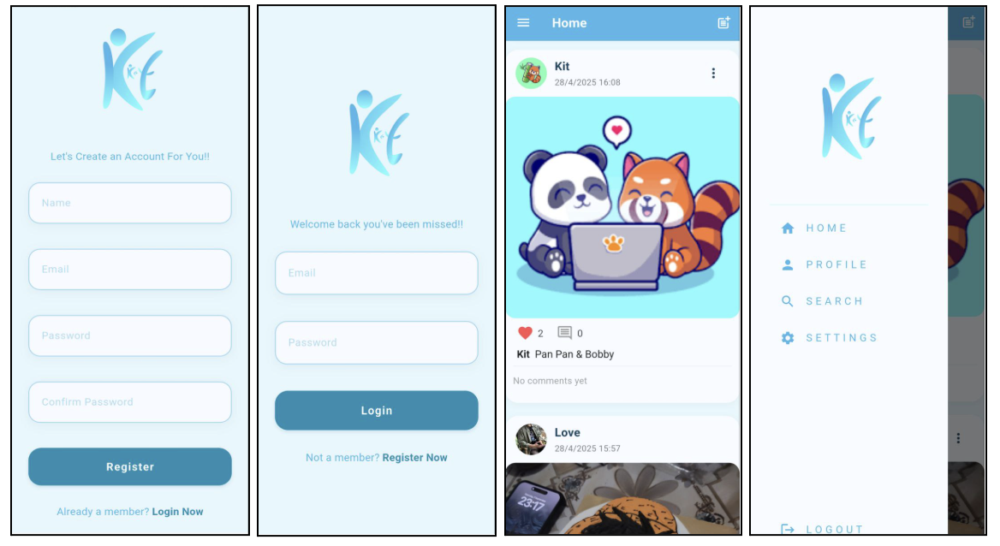
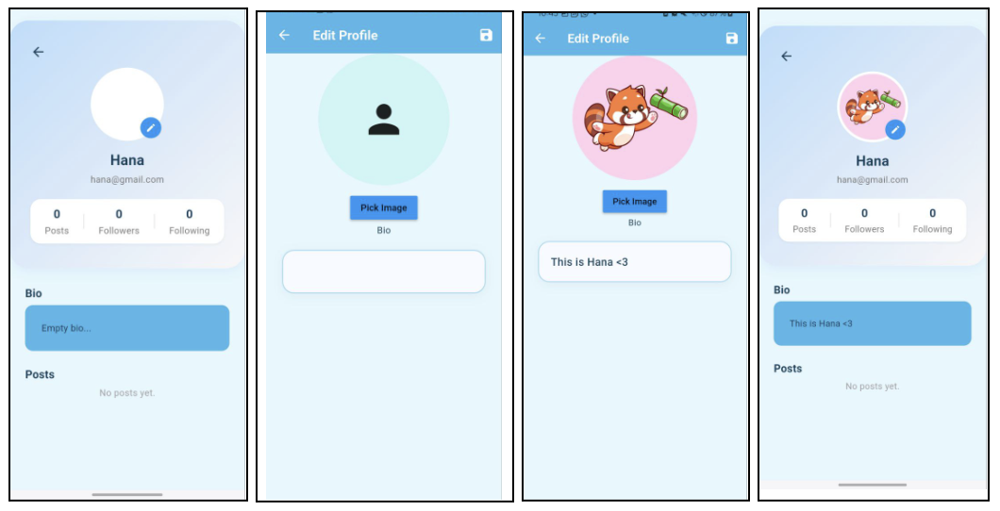
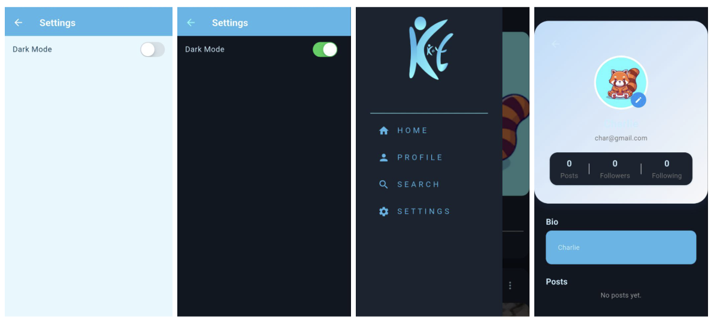
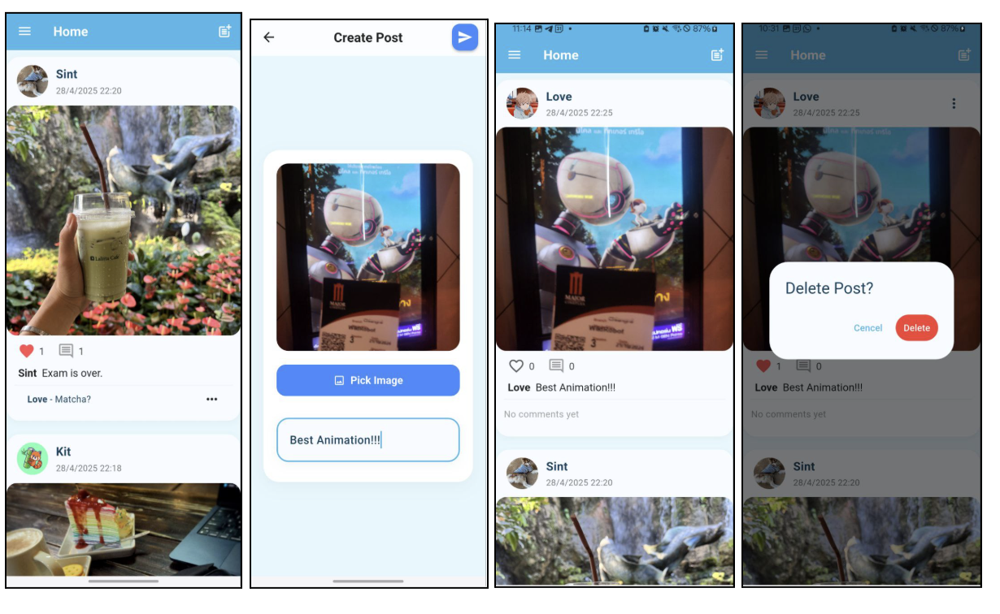
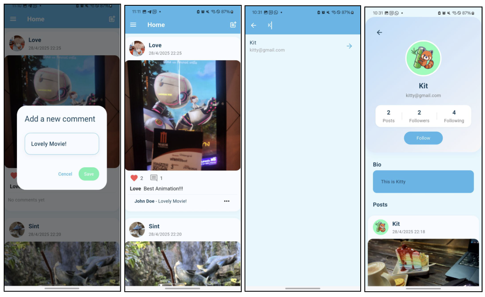
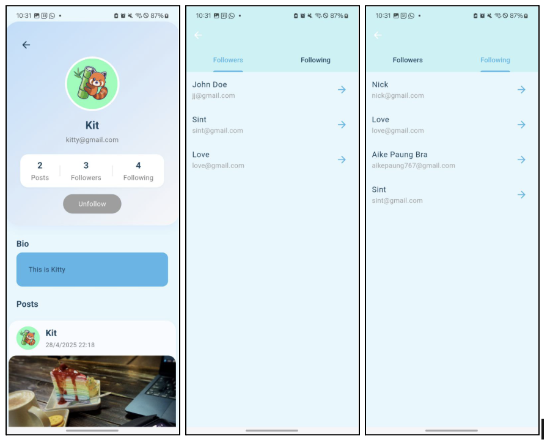

# KitKat_SocialApp
---

**Mobile Final Exam**

# **Take-home Assignment**

| Name  | Tay Zar Tun |
| :---- | :---- |
| ID | 6631503089 |
| App Name | Kit Kat Social App |
| Framework | Flutter / Firebase |
| Github | [KitKatSocailApp Github](https://github.com/TayZarTun6631503089/KitKat_SocialApp)   |
| APK | [KitKatSocailApp\_Apk](https://github.com/TayZarTun6631503089/KitKat_SocialApp/blob/main/kitkat_social_app/KitKatSocialApp_Apk/app-release.apk)    |
| Web | [https://kitkatsocialapp.web.app/](https://kitkatsocialapp.web.app/) |

1. ## **App Concept and Design**

## **📌 1.1 Target Users | User Personas**

### **🎓 Persona 1:**

* **Name:** Thwin Khant Nyar Zaw

* **Age:** 20

* **Occupation:** 2nd-year university student (Software Engineering major)

* **Goals:**   Wants to stay connected with friends, share daily moments, and discover new people in his campus community.

* **Behavior:** Regularly posts photos, likes and comments on friends’ updates, and enjoys browsing trending content.

### **💼 Persona 2:**

* **Name:** Chan Nyein Thu

* **Age:** 21

* **Occupation:** Final-year student

* **Goals:** Aims to document important milestones, keep memories organized, and interact with a wider university network.

* **Behavior:** Frequently updates his story, engages with various posts, and follows classmates and university pages.

### **📚 Persona 3:**

* **Name:** Aike Paung Bra

* **Age:** 20

* **Occupation:** Teacher (internship)

* **Goals:** Shares creative media, builds his personal profile, and interacts with followers through posts and comments.

* **Behavior:** Posts high-quality images, responds to comments, and uses features like tagging and sharing.

---

## **📌 1.2 App Goals**

* Provide a modern, interactive platform for students to share photos, stories, and daily updates.

* Encourage positive engagement through comments, likes, and following other users.

* Offer a seamless and visually appealing user experience with easy media uploads and real-time updates.

* Prioritize privacy and account security using Firebase Authentication.

* Support dark and light themes for user comfort.

---

📌 **1.3 Mock Up**

---

## **📌 1.4 User Flow | การไหลของผู้ใช้งาน**

**Flow 1: Registration and Onboarding**

Open app → Tap “Sign Up” → Enter information → Complete registration → Explore home feed and follow friends

**Flow 2: Creating a Post**

Tap “+” (create post Icon) → Pick or capture an image → Add caption → Submit → Post appears in main feed

**Flow 3: Interacting with Content**

Scroll home feed → Like/comment on posts → Follow new users → Check notifications

**Flow 4: Editing Profile**

Navigate to Profile → Change bio, profile photo → Save changes

**Flow 5: Customize Experience**

Navigate to Settings  → Toggle Dark Mode 🌙/☀️→ Tap “Logout” when done

---

## **📌 2\. App Implementation**

### **✅ 2.1 Development Details**

Tools & Technologies Used:

* **Framework: Flutter (Dart)**

* **Backend: Firebase (Authentication, Firestore, Storage)**

* **State Management: Bloc (flutter\_bloc)**

* **Image Upload: file\_picker, firebase\_storage**

* **Navigation: Navigator 2.0**

* **Design: Material You, custom themes**

### **✅ 2.2 Features Implemented | ฟังก์ชันที่พัฒนา**

**Checklist:**

- [x] User registration, login, and secure authentication

- [x] Posting photos with captions

- [x] Home feed displaying all user posts

- [x] Like and comment system for engagement

- [x] User profiles with editable bio and profile photo  
- [x] Search function to discover users and posts

- [x] Follow/unfollow functionality

- [x] Light and dark mode toggle

- [x] Responsive UI for various device sizes  
      

### **✅ 2.3 App Screenshots**

### 

---

## 

## 

## **📌 3\. App Deployment** 

### **✅ 3.1 Build Type**

- [x] Debug

- [x] Release

### **✅ 3.2 Platform Tested**

- [x] Android

- [x] iOS

- [x] Chrome-Web  
    

### **✅ 3.3 README & Install Guide**

**Steps to Install the App:**

1. Download the [.apk](https://github.com/TayZarTun6631503089/KitKat_SocialApp/blob/main/kitkat_social_app/KitKatSocialApp_Apk/app-release.apk)  file from the provided link.

2. Open the file on your Android device.

3. Allow installation from unknown sources if prompted.

4. Complete setup and start sharing moments.

---

## **📌 4\. Reflection** 

- [x] Faced and solved issues with file permissions when building APKs on an external drive.

- [x] Improved my understanding of state management using Bloc for a dynamic social feed.

- [x] Enhanced my skills with Firebase, especially real-time Firestore updates and image storage.

- [ ] If I had more time, I would implement direct messaging, advanced notifications, and in-app search.

---

## **📌 5\. AI Assisted Development** 

### **✅ 5.1 Idea Generation**

* **Prompt used:**  
   "*“Suggest social media app features suitable for university students and young adults.”*

* **Result:**  
   Helped clarify unique features to promote positive and active student engagement.

### **✅ 5.2 UI Layout Assistance**

* **Prompt used:**  
   "*Flutter photo post upload with Firebase and Bloc.”*  
  *“Modern social app layout best practices.”*

* **Result:**  
   Helped design the user interface for creating and viewing posts with intuitive image previews and clean input fields.Guided the arrangement of interactive elements such as the like, comment, and follow buttons for an engaging feed.

### **✅ 5.3 Code Writing Support**

* **Prompt used:**  
  “Flutter code for a search bar to find users and posts.”  
  “How to handle following and unfollowing users in Flutter Bloc.”  
  “Efficient state management for real-time comment updates.”

* **Result:**  
   Used AI-generated code snippets to implement the search functionality, allowing users to discover posts and profiles easily.

  Leveraged suggested patterns for writing Bloc code to manage likes, comments, and follow/unfollow actions smoothly.

  Integrated efficient state updates for instant feedback when users interact with posts or search results.

### **✅ 5.4 Debugging Help**

* **Prompt used:**  
   "Unable to resolve Firebase/Auth in React Native. How do I fix this?"

* **Result:**  
   AI suggested installing Firebase correctly, using modular imports, and fixing peer dependency issues. It also guided resolving navigation and Metro bundler errors.

### **✅ 5.5 Deployment Assistance**

* **Prompt used:**  
   "*Why does my Flutter release build fail to delete the build directory?*"

* **Result:**  
   AI guided me to close apps, clean builds, and solve permission issues.

---

## **✅ Final Submission Checklist**

- [x] All sections completed and documented clearly  
- [x] GitHub repository attached  
- [x]  APK file attached  
- [x] Reflection written and AI usage explained with reasoning

---

